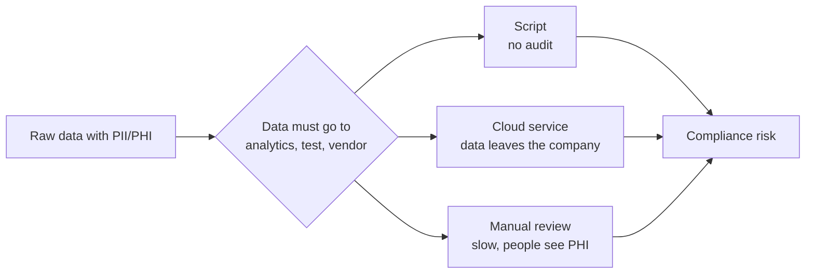
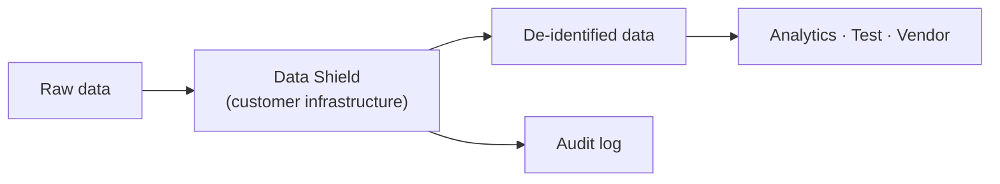

# Problem and solution

This page is for a non-technical reader. It tells what problem Data Shield solves, who uses it, and what it must do.

## The problem

Organizations that keep personal data (PII) or health data (PHI) must often share that data. They share it for analytics, software testing, research, vendors, and support. The receiver must not see the identity of the real people.

Today, teams use one of these methods:

| Method | Problem |
| --- | --- |
| One-off script | No audit trail. No fixed rules. It fails silently when the data changes |
| Cloud or LLM service | The raw data must leave the organization before the service can protect it |
| Manual review | It is slow and expensive. People make mistakes. People see the PHI |
| Generic data-masking tool | It often does not know health data (medical codes, provider IDs, EDI claims) |

The result is risk. A data leak can cause legal penalties under HIPAA, GDPR, or CCPA. It can also cause a loss of trust.

## The solution

Data Shield is a de-identification platform that runs on the customer's own infrastructure.

It does these tasks:

1. It reads the data from a file, a database, or an EDI file.
2. It finds the PII/PHI with local models and rules.
3. It applies the rules of a compliance policy, for example HIPAA.
4. It changes each sensitive value. For example, it masks, encrypts, or replaces the value.
5. It writes the safe data to a file or to a database table.
6. It records each change in an audit log.

## Who uses it

| User | Need |
| --- | --- |
| Data engineer | Prepare safe data for analytics and test systems |
| Compliance officer | Prove that each data release followed a policy |
| Auditor | Read the history of runs. Change nothing |
| Organization admin | Control users, roles, connections, and the plan |
| Platform operator | Manage all customer organizations, tiers, and features |

## Non-technical specification

### What the product must do

| ID | Requirement | Status |
| --- | --- | --- |
| R1 | Find PII/PHI in files and databases without a cloud AI service | Done |
| R2 | Support HIPAA, GDPR, CCPA, PCI-DSS, and SOC 2 | Done |
| R3 | Let an organization define its own policies and entity types | Done |
| R4 | Never let an uncertain value pass unchanged (fail closed) | Done |
| R5 | Record each change in an audit log that does not contain the original value | Done |
| R6 | Let an authorized person reverse some changes with a key | Done |
| R7 | Support many organizations with separate data | Done |
| R8 | Control access with roles and permissions | Done |
| R9 | Read from and write to customer databases | Done (PostgreSQL, MySQL, SQLite, MongoDB) |
| R10 | Read healthcare EDI files | Done (X12 5010: 834, 835, 837, 270, 271, 276, 277) |
| R11 | Process large files on dedicated compute | Done on a local emulator. Not yet on real AWS |
| R12 | Offer paid plans | Plans done. Billing not done |
| R13 | Tell the user when a job ends | Done (email and in-app) |

### Quality targets

| Area | Target |
| --- | --- |
| Privacy | No raw data goes to a third party. No plaintext PII on disk |
| Safety | When the system is not sure, it changes the value |
| Audit | Each change is traceable to a user, a time, a policy, and an operator |
| Access | Each action needs a permission |
| Scale | Free: up to 10 GB for each file. Pro: 50 GB. Enterprise: 1 TB |

### Plans

| Plan | For | Main limits |
| --- | --- | --- |
| Free | Trials and small teams | 10 GB uploads. Jobs run on the shared server |
| Pro | Teams with regular large jobs | 50 GB uploads. Up to 3 dedicated clusters at the same time |
| Enterprise | Large organizations | 1 TB uploads. Up to 10 dedicated clusters at the same time |

See [Subscription tiers](../features/subscription-tiers) for all numbers.

## What the product does not do

- It does not send data to an LLM or to a cloud AI service.
- It does not make synthetic data sets from nothing. It changes real data.
- It does not process images or scanned PDFs. It reads text-based PDFs only.
- It does not keep a stored "undo" button. Re-identification needs the key and the files again.
- It does not collect payment at this time.

See [Scope](./scope) for the technical scope and [Market comparison](./market-comparison) for other products.
