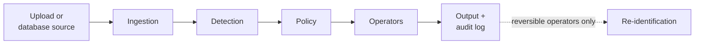

# Scope

## What Data Shield does

Data Shield takes data from a file, a database, or an EDI file. It finds PII/PHI in the data. It then makes a de-identified copy. The detection runs on the customer's own servers. No step calls a cloud AI service or an LLM.

| Stage | What it does |
| --- | --- |
| Ingestion | Reads the input format. Makes one internal shape: text, table, or document tree |
| Detection | Finds PII/PHI spans. Gives each span a confidence score |
| Policy | Selects one operator for each entity type under the selected compliance policy |
| Operators | Apply the change: mask, tokenize, encrypt, hash, pseudonym, generalize, suppress, redact, or keep |
| Output | Writes the result in the original format, or to a new database table. Writes the audit log |
| Re-identification | Reverses encrypt, tokenize, and pseudonym only. Needs the key material |

## What it handles today

| Area | Coverage | Page |
| --- | --- | --- |
| File formats | 10: CSV, TSV, Excel (`.xlsx`), JSON, JSONL, XML, plain text, SQL dump, Parquet, text-based PDF | [Ingestion](../engineering/ingestion-and-formats) |
| Databases | PostgreSQL, MySQL, SQLite, MongoDB (read and write) | [Connections](../features/connections) |
| EDI | X12 5010: 834, 835, 837P, 837I, 270, 271, 276, 277 | [EDI parser](../features/edi-parser) |
| Policies | HIPAA Safe Harbor, GDPR, CCPA, PCI-DSS, SOC 2, and custom policies | [Compliance](../compliance/regulations) |
| Operators | 9: mask, tokenize, generalize, suppress, pseudonym, hash, encrypt, keep, redact | [Policy and operators](../engineering/policy-and-operators) |
| Detection | 26 pattern recognizers, approximately 130 field-name hints, medical-code validators, an XGBoost advisory model, and a RoBERTa pass on free text | [Detection](../engineering/detection-pipeline) |
| Users | Organizations, invites, 3 system roles, custom roles, private or shared resources | [Auth](../architecture/auth-and-organizations) |
| Plans | Free, Pro, Enterprise | [Subscription tiers](../features/subscription-tiers) |
| Scale | In-process for Free. Pro and Enterprise jobs run as job-runs against the organization's own EMR Serverless application | [Big-job compute](../features/distributed-execution) |

## Limits

| Limit | Detail |
| --- | --- |
| `.xls` files | The system knows the extension. It cannot parse the legacy binary format |
| Scanned PDFs | Not supported. No OCR |
| Batch upload | A ZIP of up to 50 CSV/TSV files, with a total of 100 MB or less uncompressed |
| Reversible runs | Not allowed for tabular data at or above 200 MB. Use irreversible operators |
| EDI | Version 5010 only. EDI parsing does not de-identify. You de-identify the saved table after |
| Unsupported databases | Microsoft SQL Server, Oracle, Redis, Cassandra, and DynamoDB show in the list but are not selectable |
