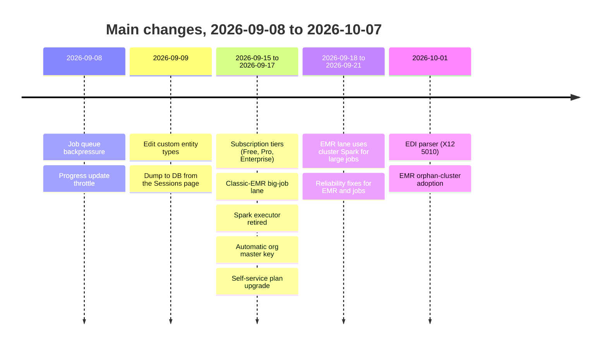

# What's new (2026-09-09 to 2026-10-07)

This page lists the changes since the last documentation update. The period has approximately 80 commits on the `dev` branch.

## New features

| Feature | What it gives the user | Page |
| --- | --- | --- |
| Subscription tiers | Free, Pro, and Enterprise plans. Each plan sets the upload limit, the retention times, and big-job access | [Subscription tiers](./features/subscription-tiers) |
| Self-service upgrade | An org admin can move to Pro or Enterprise from **Settings > Plan**. The change is immediate. There is no payment step yet | [Subscription tiers](./features/subscription-tiers) |
| Big-job compute (EMR) | Each Pro or Enterprise job gets its own AWS EMR cluster. The cluster stops automatically | [Big-job compute](./features/distributed-execution) |
| EMR monitors | Org admins see their own clusters. Platform admins see all clusters | [Big-job compute](./features/distributed-execution) |
| EDI parser | Upload an X12 834, 835, 837P, 837I, 270, 271, 276, or 277 file. Preview it as a table. Save it to a database | [EDI parser](./features/edi-parser) |
| Dump to DB | Write the output of a finished session to a new database table from the Sessions page | [Connections](./features/connections) |
| Edit custom entity types | Change the label, the category, or the description. The key stays fixed | [Custom policies](./features/custom-policies) |
| Reversibility choice | The user selects reversible or irreversible before a run starts | [De-identification workflow](./features/deidentification-workflow) |

## Changes to existing behavior

| Area | Before | Now |
| --- | --- | --- |
| Distributed execution | An org admin selected "Spark" in Settings. A shared Spark cluster ran the jobs | Spark is retired. The tier selects the lane. Free runs in the API process. Pro and Enterprise use EMR |
| Upload storage | The parsed upload stayed in API memory | Each upload goes to disk at once, encrypted with AES-256-GCM. The key stays in memory |
| Org master key | An org admin typed in a key in Settings | The system creates a key for each organization automatically. Only a platform admin can rotate it |
| Upload size | No limit by plan | 10 GB (Free), 50 GB (Pro), 1 TB (Enterprise) |
| Retention | One value for each organization | The tier sets the session time and the ZIP download time |
| Permissions | `viewSparkMonitor` | Removed. New: `viewEmrMonitor` and `useEdiParser` |
| Platform dashboard | Usage metrics | Also shows the number of organizations in each tier |

## Reliability and security fixes

| Fix | Effect |
| --- | --- |
| Queue backpressure | If 500 or more jobs wait, a new job gets HTTP 503. The queue does not grow without a limit |
| Progress throttle | The progress socket sends a few updates each second, not one update for each field |
| Cross-process job results | A job result written by one process is readable by another process |
| EMR admission counters | At start-up, the EMR runner counts the real clusters and corrects its counters |
| EMR orphan adoption | At start-up, the EMR runner finds clusters from a previous run and monitors them again |
| Deterministic detection | When two detectors give the same score on the same text, the result is always the same |
| Double-submit guard | Two fast clicks on Analyze or De-identify start only one job |
| EDI fail-closed | A broken EDI envelope causes an error. The parser does not return a partial result |
| Session delete | A deleted session also expires its wizard state |

## Retired

- The shared Spark Standalone cluster and `docker-compose.cluster.yml`.
- The org-level "executor" setting. The only value is now `sequential`.
- The Spark cluster monitor and the `viewSparkMonitor` permission.
- Manual entry of the org master key in **Settings > Security**.

## Open items

- Billing is not connected. Upgrades are free at this time.
- The EMR lane is tested on Floci, a local AWS emulator. It is not tested on a real AWS account.
- The tier numbers are first estimates. They need a cost review.
- Seat and session quotas show in the platform portal. The system does not enforce them.
