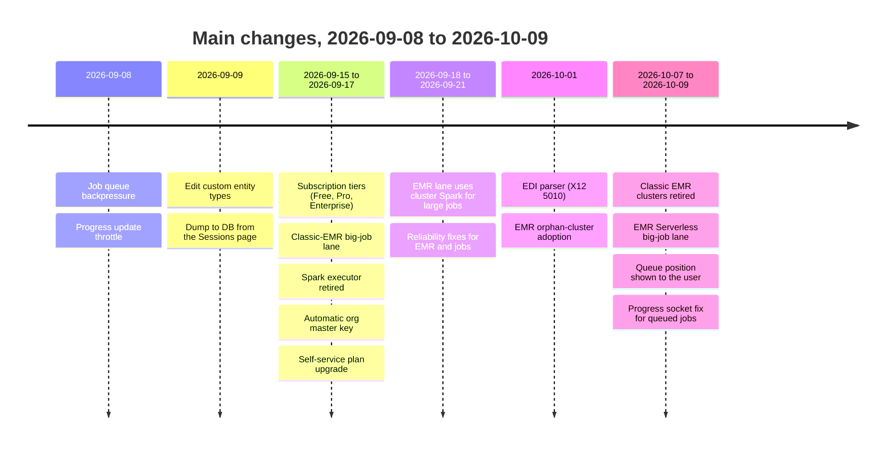

# What's new (2026-09-09 to 2026-10-09)

This page lists the changes since the last documentation update. Most of this period's commits are on the `dev` branch. The last entry below, the EMR Serverless migration, is on a feature branch (`feature/emr-serverless`) that is not yet merged into `dev` or `main`.

## New features

| Feature | What it gives the user | Page |
| --- | --- | --- |
| Subscription tiers | Free, Pro, and Enterprise plans. Each plan sets the upload limit, the retention times, and big-job access | [Subscription tiers](./features/subscription-tiers) |
| Self-service upgrade | An org admin can move to Pro or Enterprise from **Settings > Plan**. The change is immediate. There is no payment step yet | [Subscription tiers](./features/subscription-tiers) |
| Big-job compute (EMR) | Each Pro or Enterprise job got its own AWS EMR cluster. The cluster stopped automatically. Replaced on 2026-10-07 by EMR Serverless — see the dedicated entry below | [Big-job compute](./features/distributed-execution) |
| EMR monitors | Org admins see their own job-runs. Platform admins see all job-runs | [Big-job compute](./features/distributed-execution) |
| EDI parser | Upload an X12 834, 835, 837P, 837I, 270, 271, 276, or 277 file. Preview it as a table. Save it to a database | [EDI parser](./features/edi-parser) |
| Dump to DB | Write the output of a finished session to a new database table from the Sessions page | [Connections](./features/connections) |
| Edit custom entity types | Change the label, the category, or the description. The key stays fixed | [Custom policies](./features/custom-policies) |
| Reversibility choice | The user selects reversible or irreversible before a run starts | [De-identification workflow](./features/deidentification-workflow) |

## Changes to existing behavior

| Area | Before | Now |
| --- | --- | --- |
| Distributed execution | An org admin selected "Spark" in Settings. A shared Spark cluster ran the jobs | Spark is retired. The tier selects the lane. Free runs in the API process. Pro and Enterprise use EMR |
| Upload storage | The parsed upload stayed in API memory | Each upload goes to disk at once, encrypted with AES-256-GCM. The key stays in memory |
| Org master key | An org admin typed in a key in Settings | The system creates a key for each organization automatically. Only a platform admin can rotate it |
| Upload size | No limit by plan | 10 GB (Free), 50 GB (Pro), 1 TB (Enterprise) |
| Retention | One value for each organization | The tier sets the session time and the ZIP download time |
| Permissions | `viewSparkMonitor` | Removed. New: `viewEmrMonitor` and `useEdiParser` |
| Platform dashboard | Usage metrics | Also shows the number of organizations in each tier |

## Reliability and security fixes

| Fix | Effect |
| --- | --- |
| Queue backpressure | If 500 or more jobs wait, a new job gets HTTP 503. The queue does not grow without a limit |
| Progress throttle | The progress socket sends a few updates each second, not one update for each field |
| Cross-process job results | A job result written by one process is readable by another process |
| EMR admission counters | At start-up, the EMR runner counted the real clusters and corrected its counters. Classic-EMR only — removed with the admission gate on 2026-10-07; see the EMR Serverless migration entry below |
| EMR orphan adoption | At start-up, the EMR runner found clusters from a previous run and monitored them again. Classic-EMR only — replaced on 2026-10-07 by boot-ID-based startup reconciliation; see the EMR Serverless migration entry below |
| Deterministic detection | When two detectors give the same score on the same text, the result is always the same |
| Double-submit guard | Two fast clicks on Analyze or De-identify start only one job |
| EDI fail-closed | A broken EDI envelope causes an error. The parser does not return a partial result |
| Session delete | A deleted session also expires its wizard state |

## EMR Serverless migration (2026-10-07 to 2026-10-09)

The big-job compute lane moved from classic EMR clusters to AWS EMR Serverless. This work is on a feature branch (`feature/emr-serverless`), not yet merged into `dev` or `main`.

| Area | Before (classic EMR) | Now (EMR Serverless) |
| --- | --- | --- |
| Compute unit | A new, short-lived EMR cluster for each job, with Spark on YARN for large data | One long-lived EMR Serverless application for each organization. A job becomes a job-run against it |
| Job-run execution | A step container with a Java runtime, running `spark-submit` | A local job-run shim (Redis plus a subprocess). No container in the project needs a Java runtime any more |
| Capacity by tier | A core-node count (Pro: 2, Enterprise: 4) | A CPU / memory / disk capacity for the application, plus a concurrent-job-run limit. See [Big-job compute](./features/distributed-execution#who-gets-it) for the current numbers |
| Distribution inside a job-run | Spark across cluster nodes, for large files | One process, for every file size. Multi-node distribution is not available in either design today in practice, since the Spark branch was never exercised against a real multi-node cluster |
| Queue visibility | None | A waiting job shows its queue position and the organization's limit |
| Startup recovery | Re-adopted orphaned clusters by listing them | Marks any job-run left behind by a prior process instance as failed, and frees its slot |
| Session delete | The cluster for a deleted session kept running | The job-run for a deleted session is cancelled: a queued run is dropped, a running one stops within about a second |

Also fixed in this period: the analyze/de-identify progress socket used to close as soon as a job's status was not "running"; it now stays open while a job waits for an EMR slot ("provisioning"). The policy name and the entity count now appear on the Sessions & Logs page as soon as a session is analyzed, not only after it is de-identified.

See [Big-job compute](./features/distributed-execution) and [Execution lanes and EMR internals](./engineering/distributed-execution) for the current design.

## Platform quotas, Redis TTL audit (2026-10-09)

| Area | Change |
| --- | --- |
| Seat and session quotas | Now enforced (HTTP 403 over the limit), and an admin can clear a quota back to unlimited. See [Platform admin portal](./features/platform-admin-portal) |
| Platform dashboard | Splits open sessions from jobs actually running. The EMR page and sidebar say "EMR job runs" |
| Queued cancel | A job-run cancelled while still queued now shows a finish time and the queue wait as duration |
| Job records | The job record's expiry now refreshes on every write, so a long job no longer loses its record mid-run |
| Queue | The job stream is trimmed by age (`DS_JOB_QUEUE_RETENTION_SECONDS`, default 24 hours). Backpressure checks the backlog of the lane's own consumer group, so EMR jobs cannot fill the limit meant for another lane |
| EMR run index | Ids of expired job-runs are removed from the index, so it no longer grows without bound |
| Organization TTL settings | Session and download-ZIP retention overrides must be between 0 seconds and 30 days |
| Frontend | The Inter font is bundled with the app. No font file is fetched from outside |
| Tests | The test suite always uses its own SQLite database, never the dev database |

## Retired

- The shared Spark Standalone cluster and `docker-compose.cluster.yml`.
- The org-level "executor" setting. The only value is now `sequential`.
- The Spark cluster monitor and the `viewSparkMonitor` permission.
- Manual entry of the org master key in **Settings > Security**.
- Classic EMR clusters (`RunJobFlow`, one cluster for each job), the EMR admission gate that managed them, and the step container's Java runtime — replaced by EMR Serverless (2026-10-07, on the `feature/emr-serverless` branch).

## Open items

- Billing is not connected. Upgrades are free at this time.
- The EMR Serverless lane is tested on Floci, a local AWS emulator. It is not tested on a real AWS account.
- The EMR Serverless migration itself is on a feature branch, not yet merged into `dev` or `main`.
- A job-run always runs on one process. There is no multi-node distribution for a large file today.
- The Terraform repository removed its classic-EMR module and has no EMR Serverless resources, because the app only talks to the endpoint it is given (Floci today). See [AWS architecture](./cloud/aws-architecture#open-work).
- The tier numbers are first estimates. They need a cost review.
